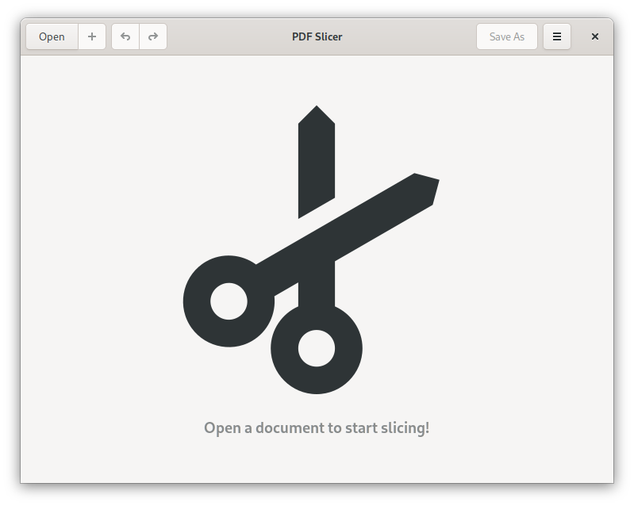
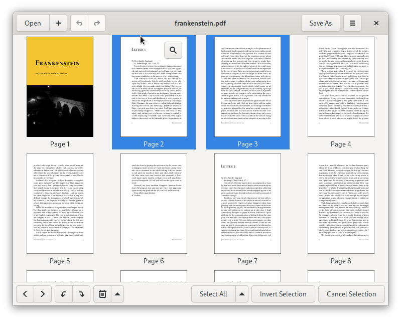
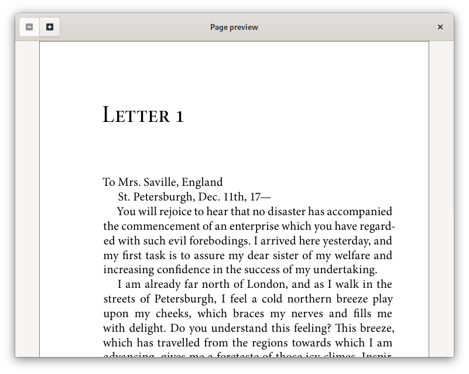

<a href="https://hosted.weblate.org/engage/pdf-slicer/?utm_source=widget">

</a>

# PDF Slicer

This is a simple application for extracting, merging, rotating and reordering pages of PDF documents,
with undo/redo support.







# Table of Contents

* [Installing](#installing)
  * [Linux](#linux)
  * [Windows](#windows)
* [Contributing](#contributing)
  * [Translations](#translations)
  * [Code](#code)
* [Building](#building)
  * [Fedora](#fedora)
  * [Flatpak](#flatpak)
  * [Windows cross-compilation (Fedora only)](#windows-cross-compilation-fedora-only)
* [License](#license)

# Installing

## Linux

You can install PDF Slicer using Flatpak. [Get it from Flathub](https://flathub.org/apps/details/com.github.junrrein.PDFSlicer).

## Windows

You can get the latest installer from the [Releases page](https://github.com/junrrein/pdfslicer/releases).

# Contributing

## Translations

You can contribute your translations at [PDF Slicer's Weblate page](https://hosted.weblate.org/projects/pdf-slicer/).

## Code

Check out the [HACKING.md](HACKING.md) file.

# Building

## Fedora

1. Install dependencies

```bash
sudo dnf install gtkmm30-devel poppler-cpp-devel cairomm-devel qpdf-devel libuuid-devel intltool gettext
```

2. Check out a copy of the source code

```bash
git clone --recursive https://github.com/junrrein/pdfslicer.git
```

3. Build the application

```bash
cd ..
mkdir build-pdfslicer
cd build-pdfslicer
cmake ../pdfslicer/ -DCMAKE_BUILD_TYPE=Release
make
```

4. Install

```bash
sudo make install
```

5. Uninstall

```bash
sudo xargs rm < install_manifest.txt
```

## Flatpak

```bash
flatpak remote-add --from gnome https://sdk.gnome.org/gnome.flatpakrepo
flatpak install gnome org.gnome.Platform//3.38
flatpak install gnome org.gnome.Sdk//3.38
git clone https://github.com/junrrein/pdfslicer.git
cd pdfslicer/build-aux/
flatpak-builder --repo=pdfslicer-repo .pdfslicer com.github.junrrein.PDFSlicer.json --force-clean
flatpak --user remote-add --no-gpg-verify --if-not-exists pdfslicer-repo pdfslicer-repo
flatpak --user install pdfslicer-repo com.github.junrrein.PDFSlicer
```

Uninstall

```bash
flatpak --user uninstall com.github.junrrein.PDFSlicer
flatpak --user remote-delete pdfslicer-repo
rm -rf pdfslicer/
```

## Windows cross-compilation (Fedora only)

```bash
sudo dnf install mingw64-gcc-c++ mingw64-gdb mingw64-gtkmm30 mingw64-hicolor-icon-theme mingw64-librsvg2 mingw64-poppler-cpp mingw64-openssl mingw32-nsis
git clone --recursive https://github.com/junrrein/pdfslicer.git
mkdir build-pdfslicer
cd build-pdfslicer
mingw64-cmake ../pdfslicer -DCMAKE_BUILD_TYPE=Release
make package
```

This proccess will generate the installer inside the `build-pdfslicer` directory with name `PDF Slicer.exe`.

# License

PDF Slicer can be used under the terms of the GNU GPL 3.0 license, or, at your option, any later version. A copy can be found at the LICENSE file.

The application icons were made by [Lapo Calamandrei](mailto:calamandrei@gmail.com) and [Tobias Bernard](mailto:tbernard@gnome.org). They can be used under the terms of the GNU GPL 3.0 license, or, at your option, any later version. A copy can be found at the LICENSE file.

A number of third-party libraries are distributed as part of this source
code repository. They are enumerated at the LICENSE-THIRD-PARTY file,
along with details about the license they were relased under.
